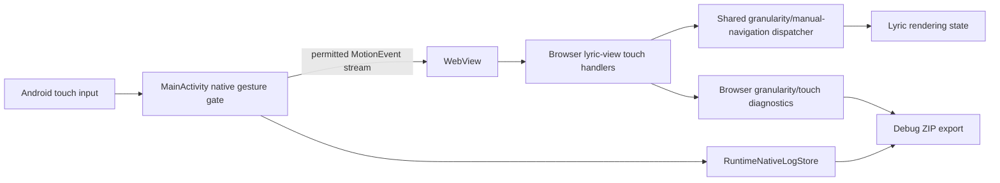

# Design Document

## Overview

This design restores Android touch gesture delivery for the lyric scene without reopening generic browser-native pinch zoom or long-press selection behavior. The root problem is not the browser granularity model itself; it is the Android wrapper touch policy. `MainActivity.kt` currently consumes multi-touch before WebView JavaScript can receive it, which blocks pinch entirely and makes drag parity hard to reason about.

The design keeps the existing shared browser interaction model as the source of truth for lyric actions:
- mouse drag -> lyric-unit navigation
- mouse wheel -> granularity zoom
- Android single-finger drag should map to the same lyric-unit navigation actions
- Android two-finger pinch should map to the same granularity zoom actions

Desktop behavior remains protected. Android-specific fixes are introduced in the wrapper and guarded browser diagnostics only.

## Architecture

### Design decisions

1. Preserve raw-event delivery where possible
- The wrapper should stop blanket-swallowing multi-touch.
- It should only block browser-native side effects, not the delivery of touch data itself.
- Rationale: the browser already has the intended gesture-to-action model and should remain the convergence point for lyric interactions.

2. Add explicit delivery instrumentation on both sides
- Native logs prove whether MotionEvents were blocked or forwarded.
- Browser logs prove whether the lyric scene actually received touch events.
- Rationale: without both, failures get misdiagnosed as either “native” or “browser” guesswork.

3. Keep desktop untouched by default
- Android touch-specific logic belongs in `axolync-android-wrapper` first.
- Shared browser code changes are limited to diagnostics and Android-safe touch receipt wiring already present in the lyric scene.

## Components and Interfaces

### 1. Native gesture gate in `MainActivity`

Current problem area:
- `webView.setOnTouchListener { ... }` consumes any multi-touch via `ACTION_POINTER_DOWN` / `pointerCount > 1`.

New responsibility:
- allow intended touch delivery to WebView
- continue preventing browser-native zoom/selection side effects
- record native diagnostics for:
  - `ACTION_DOWN`
  - `ACTION_MOVE`
  - `ACTION_UP`
  - `ACTION_CANCEL`
  - `ACTION_POINTER_DOWN`
  - `ACTION_POINTER_UP`
  - pointer count
  - whether the event was forwarded or consumed

Interface shape:
- no new public API is required
- implementation remains internal to `MainActivity`
- logging uses `RuntimeNativeLogStore`

### 2. Browser lyric-view touch receipt logging

Current browser touch handlers already exist in:
- `axolync-browser/src/main.ts`

New responsibility:
- log lyric-scene touch receipt before gesture interpretation
- log whether the handler path was:
  - single-finger drag priming
  - drag movement
  - pinch start
  - pinch action
  - touch cancellation/reset

Interface shape:
- extend existing granularity diagnostics log stream
- no new user-visible controls required

### 3. Shared lyric interaction dispatcher

The browser already has a logical dispatcher made of:
- `resolveVerticalNavigationStepDelta`
- `resolvePinchGranularityAction`
- `resolveWheelGranularityAction`
- `applyGranularityInteractionAction`
- manual lyric navigation helpers

Design constraint:
- Android touch must feed this existing action family rather than inventing a second Android-only dispatcher.

### 4. Debug export path

Existing debug ZIP already includes:
- `axolync/native-runtime-log.json`
- `axolync/granularity-log.json`

New requirement:
- ensure native touch delivery logs and browser touch receipt logs are both captured there in a way that makes cross-correlation possible.

## Data Models

### Native touch delivery log row

Recorded in `RuntimeNativeLogStore` as structured message content.

Proposed payload fields:
- `channel`: `touch-delivery`
- `action`: `ACTION_DOWN | ACTION_MOVE | ACTION_UP | ACTION_CANCEL | ACTION_POINTER_DOWN | ACTION_POINTER_UP`
- `pointerCount`: number
- `consumed`: boolean
- `forwardedToWebView`: boolean
- `reason`: short string such as `native-pinch-block`, `forward-single-touch`, `forward-multi-touch`
- `x`, `y` optional for primary pointer

### Browser touch receipt log row

Added to the existing granularity diagnostics stream.

Proposed payload fields:
- `type`: `touch.received | touch.drag.primed | touch.drag.moved | touch.pinch.started | touch.pinch.applied | touch.cleared`
- `touches`: number
- `runtime`: `android-wrapper | desktop`
- `lyricSceneVisible`: boolean
- `navigationSteps`: optional number
- `granularityAction`: optional string

## Error Handling

1. Native gate failure
- If native gesture handling throws or cannot classify a gesture, log it to `RuntimeNativeLogStore` and fall back to forwarding single-touch events rather than silently swallowing them.

2. Browser receipt absence
- If Android native logs show forwarding but browser receipt logs do not appear, treat that as a browser delivery/targeting failure and keep the evidence in exported diagnostics.

3. Unsupported multi-touch edge cases
- If a gesture cannot be safely translated while preserving browser zoom suppression, log a clear `blocked` diagnostic entry instead of failing silently.

4. Desktop safety
- If shared browser code is touched and a regression guard fails, the change is rejected rather than accepted as Android-specific collateral.

## Testing Strategy

### Android wrapper tests
- Add or extend structural/unit tests around `MainActivity.kt` to prove:
  - multi-touch is no longer blanket-consumed
  - the native touch gate still preserves zoom/selection suppression intent
  - native touch-delivery logging exists

### Browser tests
- Add regression guards in `axolync-browser` to prove:
  - Android touch handlers are still wired to the lyric scene
  - touch receipt diagnostics are written
  - drag maps to manual navigation actions
  - pinch maps to granularity actions
  - desktop mouse behavior remains unchanged

### Integration proof
- Add at least one Android-wrapper-side proof that a forwarded gesture path can be observed end-to-end through:
  - native log
  - browser receipt log
  - resulting logical action

## Research Notes

Primary references used to shape this design:
- Android `View.OnTouchListener` reference: https://developer.android.com/reference/android/view/View.OnTouchListener
- Android `MotionEvent` reference: https://developer.android.com/reference/android/view/MotionEvent
- Android `ScaleGestureDetector` reference: https://developer.android.com/reference/android/view/ScaleGestureDetector
- Android gesture docs: https://developer.android.com/develop/ui/views/touch-and-input/gestures/detector
- Android scale docs: https://developer.android.com/develop/ui/views/touch-and-input/gestures/scale
