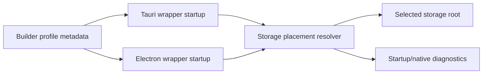

# Design Document

## Overview

Add a small wrapper-owned storage-placement layer shared by desktop wrapper templates. The layer resolves a selected storage profile into a normalized storage metadata object, ensures required directories exist, validates write access, and exposes diagnostics.

The first implementation supports the approved runtime policy:

- Windows desktop portable: `<artifact-root>/storage`
- macOS/Linux desktop: `~/.axolync/storage`

The implementation reserves future vocabulary but does not implement future `system` or `custom` placement modes.

## Architecture

## Storage Metadata Shape

Each wrapper should expose the same conceptual fields:

- `storageProfile`
- `platform`
- `storageRoot`
- `appDataDir`
- `webviewUserDataDir`
- `nativeAssetsDir`
- `logsDir`
- `cacheDir`
- `warnings`

JavaScript and Rust may use idiomatic casing internally, but diagnostics should expose camelCase JSON keys.

## Electron Strategy

Electron must resolve storage before `app.whenReady()` and BrowserWindow creation.

Implementation direction:

- add a `storagePlacement.cjs` helper in the Electron workspace template
- resolve profile from `AXOLYNC_DESKTOP_STORAGE_PROFILE` or generated runtime metadata if present, defaulting to platform policy
- call `app.setPath("userData", placement.webviewUserDataDir)` before app ready
- pass placement metadata into native companion host diagnostics
- log the placement at startup

## Tauri Strategy

Tauri must resolve storage before wrapper-owned storage is used and before app-managed runtime roots are initialized.

Implementation direction:

- add a Rust storage placement module in the Tauri workspace template
- resolve profile from `AXOLYNC_DESKTOP_STORAGE_PROFILE` or generated runtime metadata if present, defaulting to platform policy
- ensure and validate selected directories before building/running the app
- expose placement metadata through native service companion diagnostics
- document any WebView user-data path limitation if current Tauri APIs cannot redirect it in this template

## Directory Policy

Under the selected root, create:

- `app-data`
- `webview-user-data`
- `native-assets`
- `logs`
- `cache`

The selected root itself is `<artifact-root>/storage` on Windows portable and `~/.axolync/storage` on macOS/Linux.

## Error Handling

Directory creation and write checks are required. Failure must return or throw a clear error identifying:

- selected profile
- selected root
- failed path
- operation that failed

Silent fallback to OS/browser defaults is forbidden.

## Tests

Add focused tests that inspect the template code rather than launching desktop shells:

- Electron calls storage placement before `whenReady`
- Electron uses `app.setPath("userData", ...)`
- Tauri includes a storage placement module and initializes it before app run
- diagnostics contain storage placement keys
- policy constants mention Windows artifact-root storage and macOS/Linux `~/.axolync/storage`
