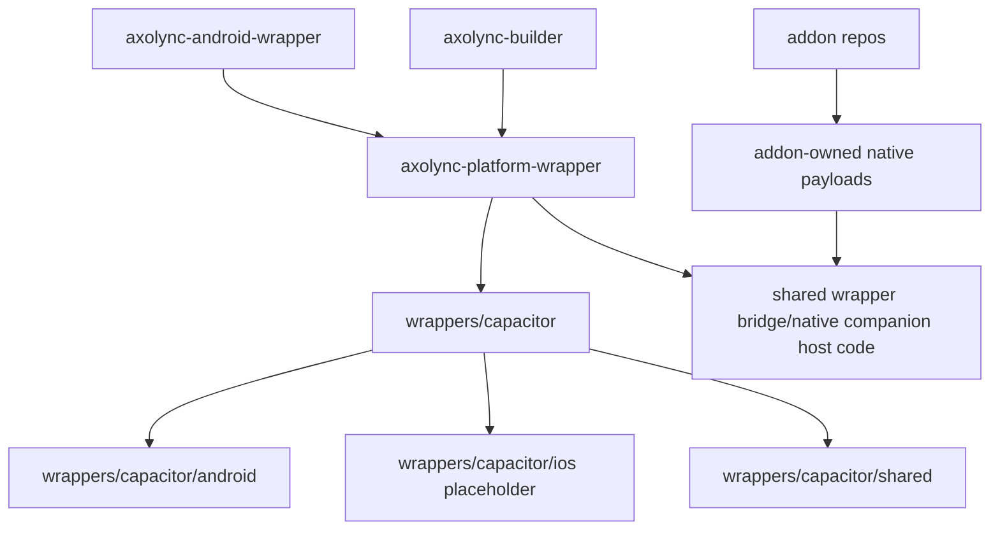

# Design Document

## Overview

This design promotes `axolync-android-wrapper` into the neutral wrapper authority path for `axolync-platform-wrapper`. The preferred implementation preserves history by renaming/refactoring the existing repo. If GitHub rename logistics block that path, this repo remains the migration source while a new sibling repo is created.

The design is intentionally repo-scoped. Builder orchestration changes belong in the builder spec. Browser capability guardrails belong in the browser spec. This repo owns wrapper host structure, Capacitor rehome, shared wrapper bridge concepts, Android build parity, and native companion host behavior.

## Architecture



## Promotion Strategy

Preferred path:

1. Keep the current checkout and refactor its internal layout toward `axolync-platform-wrapper`.
2. Update repo identity docs/config references to the target name.
3. Rehome Android code under `wrappers/capacitor/android`.
4. Add shared Capacitor and wrapper bridge areas.
5. Keep compatibility aliases where builder still expects the old repo name.

Fallback path:

1. Create a new sibling repo named `axolync-platform-wrapper`.
2. Copy/move Android code from this repo in controlled phases.
3. Keep this repo as migration source until builder and reports prove Android parity.

The implementation should avoid permanent dual ownership. Compatibility is allowed only as a transition bridge with removal criteria.

## Target Layout

Recommended shape inside the promoted repo:

```text
wrappers/
  capacitor/
    android/
      app/
      scripts/
      gradle/
    ios/
      README.md
    shared/
native-service-companions/
  host-protocol/
  deployment/
  diagnostics/
defaults/
  wrapper-defaults.toml
docs/
  android-capacitor.md
  wrapper-platform-authority.md
  migration-compatibility.md
```

The exact file moves should follow existing project constraints, but the layout must make Android a child concern under Capacitor.

## Native Companion Boundary

Wrapper-owned shared code may know how to:

- inspect installed native payload descriptors
- stage payloads into app-private runtime locations
- start or refuse native operators
- report status and diagnostics
- normalize host capability states

Addon-owned repos still own:

- native payload files
- operator descriptors
- addon-specific server code
- addon-specific fallback semantics

This boundary protects the Vibra and LRCLIB lessons learned from being copied into the wrong repo.

## Android Build Compatibility

The rehome must preserve:

- Gradle project resolution
- Capacitor asset staging
- browser output staging
- APK package generation
- native payload inclusion rules
- app startup with normal non-native APK
- truthful diagnostics for native-capable APKs

If a physical path changes, scripts and tests must move together with the files. Compatibility shims may exist while builder still consumes old paths.

## Error Handling

- Missing staged browser assets: fail with the expected path and staging command.
- Missing native payload descriptor: report unavailable capability, not running.
- Unsupported host/operator pairing: report unsupported state.
- Host trust refusal: report refused state.
- Startup failure: report startup-failed state with diagnostics.
- Compatibility alias used: report or log migration mode so stale consumption is visible.

## Testing Strategy

Tests should be local and structural where Android devices/emulators are unavailable:

- path/layout tests for required Capacitor Android files
- staging tests for browser asset placement
- native payload path normalization tests
- duplicate compressed payload prevention tests
- capability mapping tests for Vibra and LRCLIB operator states
- compatibility alias tests for builder-facing old path use during transition

Real device/emulator proof is useful later, but this spec should not block on it.

## Self-Review Notes

- Design is scoped to wrapper repo promotion, not builder orchestration.
- Design supports rename/refactor first while allowing a new sibling fallback.
- Design preserves Android buildability and native bridge diagnostics.
- Design keeps browser out of wrapper identity and keeps addon payload ownership in addon repos.
