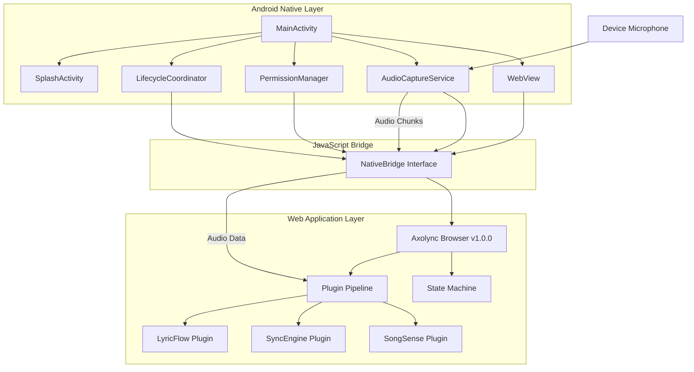

# Design Document: Android APK Wrapper

## Overview

The Android APK Wrapper is a native Android application that hosts the complete Axolync karaoke companion web experience (axolync-browser v1.0.0) within a WebView. The wrapper provides a native Android shell that handles platform-specific concerns (microphone permissions, audio capture, lifecycle management, splash screen) while preserving the complete state machine and UX semantics of the web application.

### Design Goals

1. **Baseline Preservation**: Maintain 100% functional parity with axolync-browser v1.0.0 state machine and UX
2. **Native Integration**: Provide seamless Android platform integration (permissions, lifecycle, UI patterns)
3. **Performance**: Meet strict SLOs for cold start (≤3s) and audio latency (≤150ms)
4. **Security**: Minimize WebView attack surface and prevent unauthorized access through strict origin validation
5. **Maintainability**: Enable independent updates of wrapper and backend provider projects
6. **Direct Integration**: Use the original axolync-browser project files directly without modification

### Architecture Approach

The design follows a **thin native wrapper** pattern where:
- The Android app serves as a minimal hosting layer around the complete axolync-browser web application
- The Android app runs the built axolync-browser client artifacts directly in WebView; source TypeScript remains in the submodule as the authoritative source
- The axolync-browser submodule is the authoritative source - no modification or repackaging of web app code
- Native-to-web communication uses a minimal, well-defined JavaScript bridge
- The wrapper acts as a native container that hosts the complete web application as-is
- Built/bundled output from axolync-browser is served as static assets from `file:///android_asset/` (no embedded server in v1)

This approach minimizes platform-specific code duplication, leverages the mature web implementation as the source of truth, and ensures the Android app is essentially a native shell around the unmodified axolync-browser web application.

## Architecture

### High-Level Architecture



### Component Layers

1. **Native Android Layer**: Platform-specific services (audio, permissions, lifecycle)
2. **JavaScript Bridge Layer**: Minimal interface for native-web communication
3. **Web Application Layer**: Complete Axolync experience (state machine, plugins, UI)

### Data Flow

1. **App Startup**: SplashActivity → MainActivity → WebView loads bundled assets → State machine initializes
2. **Audio Capture**: User action → Permission check → AudioCaptureService starts → Audio chunks → Bridge → Plugin pipeline
3. **State Transitions**: User interaction → Web app state machine → UI updates (all in web layer)
4. **Lifecycle Events**: Android system → LifecycleCoordinator → Bridge → Web app state preservation

## Components and Interfaces

### 1. MainActivity (Native Android)

**Responsibility**: Primary activity that hosts the WebView and coordinates native services.

**Key Methods**:
```kotlin
class MainActivity : AppCompatActivity() {
    private lateinit var webView: WebView
    private lateinit var audioCaptureService: AudioCaptureService
    private lateinit var permissionManager: PermissionManager
    private lateinit var lifecycleCoordinator: LifecycleCoordinator
    private lateinit var nativeBridge: NativeBridge
    
    override fun onCreate(savedInstanceState: Bundle?)
    override fun onResume()
    override fun onPause()
    override fun onDestroy()
    fun onRequestPermissionsResult(requestCode: Int, permissions: Array<String>, grantResults: IntArray)
}
```

**Interactions**:
- Initializes WebView with security configuration
- Loads bundled web assets from `file:///android_asset/`
- Registers NativeBridge as JavaScript interface
- Delegates lifecycle events to LifecycleCoordinator

### 2. SplashActivity (Native Android)

**Responsibility**: Display splash screen during app initialization.

**Key Methods**:
```kotlin
class SplashActivity : AppCompatActivity() {
    override fun onCreate(savedInstanceState: Bundle?)
    private fun checkInitialization()
    private fun navigateToMain()
}
```

**Behavior**:
- Displays splash screen immediately on launch
- Monitors WebView readiness signal from MainActivity
- Transitions to MainActivity when web app signals ready state
- Handles slow device scenarios by maintaining splash until timeout or ready signal

### 3. AudioCaptureService (Native Android)

**Responsibility**: Capture audio from device microphone and deliver to web application.

**Key Methods**:
```kotlin
class AudioCaptureService {
    fun startCapture(sampleRate: Int, channelConfig: Int, audioFormat: Int): Result<Unit>
    fun stopCapture()
    fun isCapturing(): Boolean
    private fun captureLoop()
    fun setAudioCallback(callback: (ByteArray) -> Unit)
}
```

**Implementation Details**:
- Uses `AudioRecord` API for low-latency audio capture
- Default configuration: 44.1kHz sample rate, mono channel, 16-bit PCM (internal capture format)
- Buffer size calculated using `AudioRecord.getMinBufferSize()` with 2x multiplier for stability
- Capture loop runs on dedicated background thread
- Delivers audio chunks via callback to NativeBridge
- Target latency: ≤150ms from start action to first chunk available

**Audio Format and Bridge Contract**:
- Internal capture: Raw PCM 16-bit data as `ByteArray`
- Bridge output format: `Float32Array` normalized to `[-1, 1]` (PCM_F32)
- Conversion happens before delivering to JavaScript bridge to match Axolync plugin pipeline contract
- Chunk size: 4096 bytes raw (configurable), converted to equivalent Float32Array length
- Delivered to JavaScript as Float32Array (via ArrayBuffer) matching the existing core contract used by the app pipeline

### 4. PermissionManager (Native Android)

**Responsibility**: Handle Android runtime permissions for microphone access.

**Key Methods**:
```kotlin
class PermissionManager(private val activity: Activity) {
    fun checkMicrophonePermission(): PermissionStatus
    fun requestMicrophonePermission()
    fun shouldShowRationale(): Boolean
    fun openAppSettings()
}

enum class PermissionStatus {
    GRANTED, DENIED, DENIED_PERMANENTLY
}
```

**Permission Flow**:
1. Check permission status before audio capture
2. If denied: Show rationale dialog explaining why microphone is needed
3. Request permission via Android system dialog
4. If denied permanently: Provide button to open app settings
5. Notify web app of permission status via bridge

### 5. LifecycleCoordinator (Native Android)

**Responsibility**: Manage Android lifecycle events and coordinate with web application state.

**Key Methods**:
```kotlin
class LifecycleCoordinator(
    private val webView: WebView,
    private val audioCaptureService: AudioCaptureService,
    private val nativeBridge: NativeBridge
) {
    fun onAppPause()
    fun onAppResume()
    fun onAppBackground()
    fun onAppForeground()
    fun onLowMemory()
    fun saveState(): Bundle
    fun restoreState(bundle: Bundle)
}
```

**Lifecycle Handling**:
- **onPause**: Suspend audio capture, notify web app via bridge
- **onResume**: Restore audio capture if previously active, notify web app
- **onBackground**: Persist web app state to SharedPreferences
- **onForeground**: Restore web app state from SharedPreferences
- **onLowMemory**: Notify web app to release non-critical resources

### 6. NativeBridge (JavaScript Interface)

**Responsibility**: Minimal bidirectional communication layer between native Android and web application.

**Exposed JavaScript Interface**:
```kotlin
class NativeBridge(
    private val webView: WebView,
    private val audioCaptureService: AudioCaptureService,
    private val permissionManager: PermissionManager
) {
    @JavascriptInterface
    fun startAudioCapture(): String  // Returns JSON: {success: bool, error?: string}
    
    @JavascriptInterface
    fun stopAudioCapture(): String
    
    @JavascriptInterface
    fun checkMicrophonePermission(): String  // Returns JSON: {status: "granted"|"denied"|"denied_permanently"}
    
    @JavascriptInterface
    fun requestMicrophonePermission()
    
    @JavascriptInterface
    fun openAppSettings()
    
    @JavascriptInterface
    fun getNetworkStatus(): String  // Returns JSON: {online: bool, type?: string}
    
    @JavascriptInterface
    fun appReady()  // Signal from web app that initialization is complete
    
    @JavascriptInterface
    fun logError(message: String)  // Error logging from web to native
    
    // Native-to-Web calls (via evaluateJavascript)
    fun deliverAudioChunk(float32Pcm: FloatArray)  // Calls window.AxolyncNative.onAudioChunk(float32Pcm) with Float32Array
    fun notifyLifecycleEvent(event: String)  // Calls window.AxolyncNative.onLifecycle(event)
    fun notifyPermissionResult(status: String)  // Calls window.AxolyncNative.onPermissionResult(status)
}
```

**Security Considerations**:
- Only expose minimal required methods
- All methods return JSON strings (no complex object serialization)
- Input validation on all parameters
- No file system or network access exposed
- Registered only for app's bundled origin

**Web-Side Interface**:
```javascript
// Expected interface in web application
window.AxolyncNative = {
    onAudioChunk: (float32Pcm) => { /* Handle Float32Array audio data */ },
    onLifecycle: (event) => { /* Handle lifecycle event */ },
    onPermissionResult: (status) => { /* Handle permission result */ }
};

// Calling native from web
window.AndroidBridge.startAudioCapture();
```

### 7. WebView Configuration

**Responsibility**: Secure and performant WebView setup.

**Configuration**:
```kotlin
fun configureWebView(webView: WebView) {
    webView.settings.apply {
        javaScriptEnabled = true
        domStorageEnabled = true
        databaseEnabled = true
        allowFileAccess = false  // Disable arbitrary file access; only bundled android_asset content is loaded by design
        allowContentAccess = false
        allowFileAccessFromFileURLs = false
        allowUniversalAccessFromFileURLs = false
        mixedContentMode = WebSettings.MIXED_CONTENT_NEVER_ALLOW
        cacheMode = WebSettings.LOAD_DEFAULT
        
        // Performance optimizations (API level 18+)
        // Note: Deprecated settings removed for modern Android compatibility
    }
    
    // Security: Disable remote debugging in production
    if (!BuildConfig.DEBUG) {
        WebView.setWebContentsDebuggingEnabled(false)
    }
    
    // Restrict navigation to app origins only with strict URL validation
    webView.webViewClient = object : WebViewClient() {
        override fun shouldOverrideUrlLoading(view: WebView, request: WebResourceRequest): Boolean {
            val url = request.url.toString()
            return if (url.startsWith("file:///android_asset/") || isAllowedOrigin(request.url)) {
                false  // Allow navigation
            } else {
                true  // Block navigation
            }
        }
        
        override fun shouldInterceptRequest(view: WebView, request: WebResourceRequest): WebResourceResponse? {
            // Enforce origin policy for all subresource/network requests
            if (!isAllowedOrigin(request.url) && !request.url.toString().startsWith("file:///android_asset/")) {
                // Block untrusted subresource requests
                return WebResourceResponse("text/plain", "UTF-8", null)
            }
            return super.shouldInterceptRequest(view, request)
        }
    }
    
    // Add JavaScript interface
    webView.addJavascriptInterface(nativeBridge, "AndroidBridge")
}

fun isAllowedOrigin(uri: Uri): Boolean {
    // Strict URL parsing with exact scheme + host + port checks
    // Top-level navigation checks alone are insufficient - must also restrict subresources
    val allowedOrigins = listOf(
        Triple("https", "api.axolync.com", 443),  // Example provider endpoint
        // Add other trusted origins as needed with explicit scheme, host, port
    )
    
    val scheme = uri.scheme ?: return false
    val host = uri.host ?: return false
    val port = if (uri.port == -1) {
        if (scheme == "https") 443 else if (scheme == "http") 80 else return false
    } else {
        uri.port
    }
    
    return allowedOrigins.any { (allowedScheme, allowedHost, allowedPort) ->
        scheme == allowedScheme && host == allowedHost && port == allowedPort
    }
}
```

**Security Policy Notes**:
- Origin validation uses strict URL parsing with exact `scheme + host + port` matching
- Substring host matching (e.g., `url.contains(host)`) is explicitly avoided to prevent bypass attacks
- Top-level navigation checks are necessary but insufficient - subresource/network request restrictions are enforced via `shouldInterceptRequest`
- WebView is configured to block all untrusted origins for both navigation and resource loading

### 8. Asset Management

**Responsibility**: Bundle and serve web application assets.

**Asset Structure**:
```
app/src/main/assets/
├── axolync-browser/          # Complete built output from axolync-browser submodule
│   ├── index.html
│   ├── js/
│   │   ├── app.bundle.js
│   │   ├── state-machine.js
│   │   └── plugins/
│   │       ├── songsense.js
│   │       ├── syncengine.js
│   │       └── lyricflow.js
│   ├── css/
│   │   └── styles.css
│   ├── workers/
│   │   └── plugin-worker.js
│   └── manifest.json
```

**Loading Strategy**:
- WebView loads `file:///android_asset/axolync-browser/index.html` on startup
- All assets served directly from the built/bundled output of the axolync-browser submodule as static files
- The entire axolync-browser web application runs within the WebView from bundled assets (no embedded server in v1)
- No modification or repackaging of web app code - axolync-browser remains the authoritative source
- Web Workers supported via `file://` protocol
- Plugin packages stored in app-private storage: `context.filesDir/plugins/`

### 9. Plugin Package Management

**Responsibility**: Install, update, and validate plugin packages.

**Key Methods**:
```kotlin
class PluginManager(private val context: Context) {
    fun installPlugin(packagePath: String, pluginId: String): Result<Unit>
    fun updatePlugin(pluginId: String, newPackagePath: String): Result<Unit>
    fun validatePlugin(packagePath: String): Result<PluginMetadata>
    fun rollbackPlugin(pluginId: String): Result<Unit>
    fun listInstalledPlugins(): List<PluginMetadata>
    fun getPluginPath(pluginId: String): String?
}

data class PluginMetadata(
    val id: String,
    val version: String,
    val checksum: String,
    val signature: String?
)
```

**Storage Location**:
- Base path: `context.filesDir/plugins/` (app-private, no special permissions needed)
- Plugin structure: `plugins/{pluginId}/{version}/`
- Backup for rollback: `plugins/{pluginId}/backup/`

**Installation Flow**:
1. Download plugin package (from provider API or bundled)
2. Validate checksum/signature
3. Backup current version (if exists)
4. Extract to plugin directory
5. Update plugin registry (SharedPreferences or SQLite)
6. Notify web app of new plugin availability
7. On failure: Rollback to backup, signal error to web app

**Update Flow**:
1. Check current version
2. Download new version
3. Validate new package
4. Backup current version
5. Install new version
6. Test plugin load (basic smoke test)
7. On success: Delete backup after grace period
8. On failure: Rollback to backup, log error

### 10. Network Connectivity Monitor

**Responsibility**: Detect and report network availability.

**Key Methods**:
```kotlin
class NetworkMonitor(private val context: Context) {
    fun isOnline(): Boolean
    fun getConnectionType(): ConnectionType
    fun registerCallback(callback: (Boolean) -> Unit)
    fun unregisterCallback()
}

enum class ConnectionType {
    WIFI, CELLULAR, NONE
}
```

**Implementation**:
- Uses `ConnectivityManager` and `NetworkCallback`
- Monitors network state changes
- Notifies web app via bridge when connectivity changes
- Web app displays appropriate UX based on connectivity status

## Data Models

### 1. Audio Chunk

```kotlin
data class AudioChunk(
    val data: FloatArray,  // Normalized to [-1, 1] for bridge contract
    val timestamp: Long,
    val sampleRate: Int,
    val channelCount: Int,
    val format: AudioFormat
)

enum class AudioFormat {
    PCM_F32,  // Float32 format for bridge output (matches plugin pipeline contract)
    PCM_16BIT  // Internal capture format
}
```

**Serialization to JavaScript**:
```json
{
  "data": "[Float32Array transferred as ArrayBuffer]",
  "timestamp": 1234567890,
  "sampleRate": 44100,
  "channelCount": 1,
  "format": "PCM_F32"
}
```

**Bridge Contract**:
- Internal capture uses PCM_16BIT for native AudioRecord
- Conversion to Float32Array (normalized [-1, 1]) happens before bridge delivery
- JavaScript receives Float32Array matching the existing Axolync plugin pipeline contract

### 2. Permission Status

```kotlin
data class PermissionResult(
    val permission: String,
    val status: PermissionStatus,
    val canRequest: Boolean,
    val shouldShowRationale: Boolean
)
```

### 3. Lifecycle Event

```kotlin
data class LifecycleEvent(
    val type: LifecycleEventType,
    val timestamp: Long,
    val metadata: Map<String, String> = emptyMap()
)

enum class LifecycleEventType {
    PAUSE, RESUME, BACKGROUND, FOREGROUND, LOW_MEMORY, DESTROY
}
```

### 4. App State Snapshot

```kotlin
data class AppStateSnapshot(
    val webAppState: String,  // JSON serialized from web app
    val audioCapturing: Boolean,
    val lastActiveTimestamp: Long,
    val pluginVersions: Map<String, String>
)
```

**Persistence**:
- Stored in SharedPreferences as JSON
- Saved on background/pause events
- Restored on foreground/resume events
- Passed to web app via bridge for state restoration

### 5. Plugin Metadata

```kotlin
data class PluginMetadata(
    val id: String,
    val name: String,
    val version: String,
    val checksum: String,
    val signature: String?,
    val installPath: String,
    val installedAt: Long,
    val lastUpdated: Long
)
```

### 6. Network Status

```kotlin
data class NetworkStatus(
    val online: Boolean,
    val connectionType: ConnectionType,
    val timestamp: Long
)
```

## Correctness Properties

*A property is a characteristic or behavior that should hold true across all valid executions of a system—essentially, a formal statement about what the system should do. Properties serve as the bridge between human-readable specifications and machine-verifiable correctness guarantees.*

### Property 1: State Machine Parity

*For any* sequence of user actions, the resulting state and available transitions in the Android wrapper SHALL match the axolync-browser v1.0.0 baseline exactly.

**Validates: Requirements 1.2, 4.1, 4.3**

### Property 2: State Name Consistency

*For any* state in the state machine, the state name string in the Android wrapper SHALL match exactly the state name defined in axolync-browser v1.0.0.

**Validates: Requirements 4.4**

### Property 3: Splash Screen Persistence

*For any* device (including slow devices), the splash screen SHALL remain visible until the web application signals ready state or timeout is reached.

**Validates: Requirements 2.2**

### Property 4: Permission-Gated Capture

*For any* attempt to start audio capture, if microphone permission is denied, then capture SHALL fail and remain inactive.

**Validates: Requirements 3.1**

### Property 5: Capture Enablement After Permission Grant

*For any* microphone permission grant event, audio capture SHALL become available for the plugin pipeline.

**Validates: Requirements 3.3**

### Property 6: Invalid Plugin Rejection

*For any* plugin package with invalid checksum or signature, installation SHALL be rejected and the system SHALL remain in its previous state.

**Validates: Requirements 5.8, 5.11**

### Property 7: Plugin Update Rollback

*For any* plugin update that fails validation or loading, the system SHALL rollback to the previous working version of that plugin.

**Validates: Requirements 5.9**

### Property 8: Offline Feature Degradation

*For any* attempt to perform song identification or lyric synchronization when network connectivity is unavailable, the operation SHALL fail gracefully with appropriate user feedback.

**Validates: Requirements 7.1**

### Property 9: Network Check Before Network Operations

*For any* network-dependent operation (song identification, lyric sync), network availability SHALL be verified before attempting the operation.

**Validates: Requirements 7.3**

### Property 10: State Preservation During Connectivity Changes

*For any* transition from online to offline state, the current application state SHALL be preserved and remain accessible.

**Validates: Requirements 7.5**

### Property 11: Audio Capture Latency Bound

*For any* audio capture start action on target device profile, the time from start action to first captured chunk available to plugin pipeline SHALL be ≤ 150ms.

**Validates: Requirements 8.2, 8.4**

### Property 12: Cold Start Performance

*For any* app cold start on target device class (mid-range Android 2019+, 4GB RAM), the time from launch to first render SHALL be ≤ 3 seconds.

**Validates: Requirements 8.3, 10.6**

### Property 13: Audio Chunk Jitter Tolerance

*For any* audio processing loop, the system SHALL tolerate up to 2 consecutive missed chunks before signaling an error.

**Validates: Requirements 8.5**

### Property 14: Pause Suspends Capture

*For any* app pause event, if audio capture is active, then capture SHALL be suspended.

**Validates: Requirements 10.1**

### Property 15: Resume Restores Capture

*For any* app resume event, if audio capture was active before pause, then capture SHALL be restored to active state.

**Validates: Requirements 10.2**

### Property 16: Lifecycle State Round-Trip

*For any* application state, sending the app to background and then returning to foreground SHALL preserve the application state (round-trip property).

**Validates: Requirements 10.3, 10.4**

### Property 17: Untrusted Origin Blocking

*For any* URL with origin not in the allowlist, navigation and resource loading SHALL be blocked by the WebView.

**Validates: Requirements 11.6, 11.8**

### Property 18: Audio Timestamp Monotonicity

*For any* sequence of audio chunks captured during a single session, timestamps SHALL be monotonically increasing and chunk duration SHALL be non-negative.

**Validates: Requirements 8.1** (derived from audio routing correctness)

### Property 19: Origin Validation Strictness

*For any* origin validation check, the system SHALL use exact `scheme + host + port` matching and SHALL NOT use substring matching on hostnames.

**Validates: Requirements 11.6, 11.8** (security correctness)

## Error Handling

### Audio Capture Errors

**Microphone Permission Denied**:
- Error: `PERMISSION_DENIED`
- Handling: Display rationale dialog, provide path to grant permission or open settings
- Recovery: User grants permission → retry capture

**Audio Hardware Unavailable**:
- Error: `AUDIO_HARDWARE_ERROR`
- Handling: Display error message indicating hardware issue
- Recovery: User restarts app or checks device audio settings

**Capture Initialization Timeout**:
- Error: `CAPTURE_TIMEOUT`
- Handling: Log error, notify user of audio initialization failure
- Recovery: User retries capture action

**Excessive Chunk Jitter**:
- Error: `AUDIO_JITTER_EXCEEDED`
- Handling: Stop capture, log diagnostic info, notify user
- Recovery: User retries capture (may indicate device performance issue)

### Plugin Management Errors

**Invalid Plugin Package**:
- Error: `PLUGIN_INVALID`
- Handling: Reject installation, display error with details (checksum mismatch, signature invalid)
- Recovery: User downloads valid plugin package

**Plugin Update Failure**:
- Error: `PLUGIN_UPDATE_FAILED`
- Handling: Rollback to previous version, log error details, notify user
- Recovery: System continues with previous working version

**Plugin Load Error**:
- Error: `PLUGIN_LOAD_ERROR`
- Handling: Disable plugin, display error, attempt rollback if update was recent
- Recovery: User reinstalls plugin or waits for fix

**Corrupt Plugin Package**:
- Error: `PLUGIN_CORRUPT`
- Handling: Prevent partial activation, display deterministic error UX, remove corrupt files
- Recovery: User reinstalls plugin from trusted source

### Network Errors

**Connectivity Lost During Operation**:
- Error: `NETWORK_DISCONNECTED`
- Handling: Preserve current state, display connectivity status message
- Recovery: Automatic retry when connectivity restored

**API Request Timeout**:
- Error: `REQUEST_TIMEOUT`
- Handling: Cancel request, display timeout message
- Recovery: User retries operation

**API Request Failed**:
- Error: `REQUEST_FAILED`
- Handling: Display error with status code/message
- Recovery: User retries or checks network settings

### Lifecycle Errors

**State Restoration Failure**:
- Error: `STATE_RESTORE_FAILED`
- Handling: Initialize to default state, log error
- Recovery: App starts fresh (user may lose in-progress session)

**Low Memory Pressure**:
- Error: `LOW_MEMORY`
- Handling: Release non-critical resources, notify web app to reduce memory usage
- Recovery: System continues with reduced resource footprint

### WebView Errors

**Asset Load Failure**:
- Error: `ASSET_LOAD_ERROR`
- Handling: Display error screen, log details
- Recovery: User restarts app (may indicate corrupted APK)

**JavaScript Bridge Error**:
- Error: `BRIDGE_ERROR`
- Handling: Log error with context, attempt to continue operation
- Recovery: Depends on specific bridge call failure

**Untrusted Navigation Blocked**:
- Error: `NAVIGATION_BLOCKED`
- Handling: Block navigation, log security event
- Recovery: No user action needed (security protection working as intended)

## Testing Strategy

### Dual Testing Approach

The testing strategy employs both unit testing and property-based testing as complementary approaches:

- **Unit tests**: Verify specific examples, edge cases, error conditions, and integration points
- **Property tests**: Verify universal properties across all inputs through randomization
- Together these provide comprehensive coverage: unit tests catch concrete bugs, property tests verify general correctness

### Unit Testing Focus

Unit tests should focus on:
- Specific examples that demonstrate correct behavior (e.g., splash screen displays on startup)
- Integration points between components (e.g., bridge calls between native and web)
- Edge cases and error conditions (e.g., permission denied, network unavailable)
- Configuration validation (e.g., WebView security settings, debugging disabled in production)

Avoid writing too many unit tests for scenarios that property-based tests can cover through input randomization.

### Property-Based Testing Configuration

**Library Selection**: Use a property-based testing library appropriate for Kotlin/Android:
- Kotest Property Testing (recommended for Kotlin)
- JUnit-Quickcheck (Java-based alternative)

**Test Configuration**:
- Minimum 100 iterations per property test (due to randomization)
- Each property test must reference its design document property via comment tag
- Tag format: `// Feature: android-apk-wrapper, Property {number}: {property_text}`

**Property Test Implementation**:
- Each correctness property SHALL be implemented by a SINGLE property-based test
- Tests generate random inputs (actions, states, audio data, etc.) to verify properties hold universally
- Failures should report the specific input that violated the property

### Example Property Test Structure

```kotlin
class StateParityPropertyTest : StringSpec({
    "Feature: android-apk-wrapper, Property 1: State Machine Parity" {
        checkAll(100, Arb.list(Arb.userAction())) { actions ->
            val webState = applyActionsToWeb(actions)
            val androidState = applyActionsToAndroid(actions)
            webState shouldBe androidState
        }
    }
})
```

### Test Coverage Requirements

1. **State Machine Parity** (Property 1): Generate random action sequences, verify state equivalence
2. **Audio Capture** (Properties 4, 5, 11, 13, 14, 15, 18): Test permission states, latency bounds, lifecycle transitions, timestamp monotonicity
3. **Plugin Management** (Properties 6, 7): Generate valid/invalid plugin packages, test rollback scenarios
4. **Network Handling** (Properties 8, 9, 10): Test online/offline transitions, network checks
5. **Performance** (Properties 11, 12): Measure latency and cold start times on target devices
6. **Security** (Properties 17, 19): Test origin validation with various URL formats, verify blocking behavior
7. **Lifecycle** (Properties 14, 15, 16): Test pause/resume/background/foreground transitions

### Physical Device Testing

The following tests MUST be executed on physical Android devices (not emulators):
- Audio capture latency measurements (Property 11)
- Cold start performance (Property 12)
- Audio routing and quality validation
- Lifecycle state preservation under real memory pressure

Target device profile: Mid-range Android devices from 2019 or newer with minimum 4GB RAM.

### Automation and Demo Support

- Fake microphone capture implementation for automated testing
- Scripted test scenarios for state machine validation
- Demo mode with pre-recorded audio for UI/UX testing without live microphone

